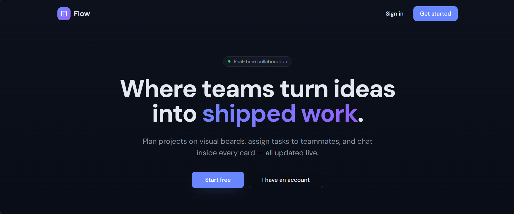
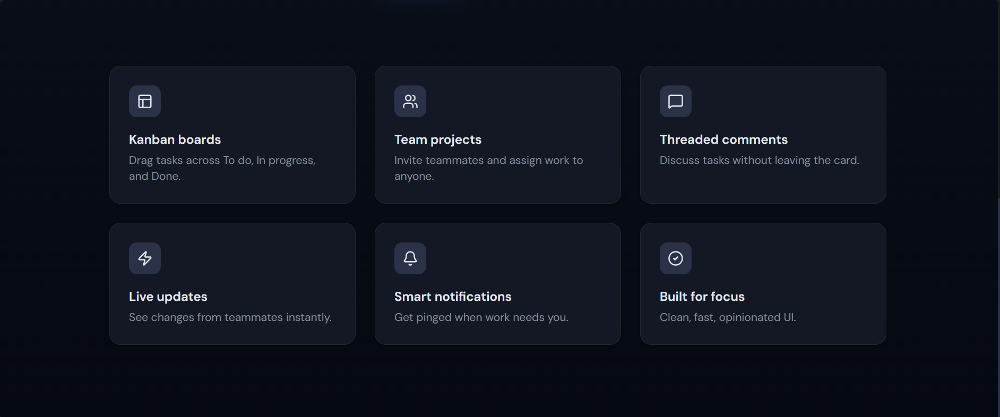
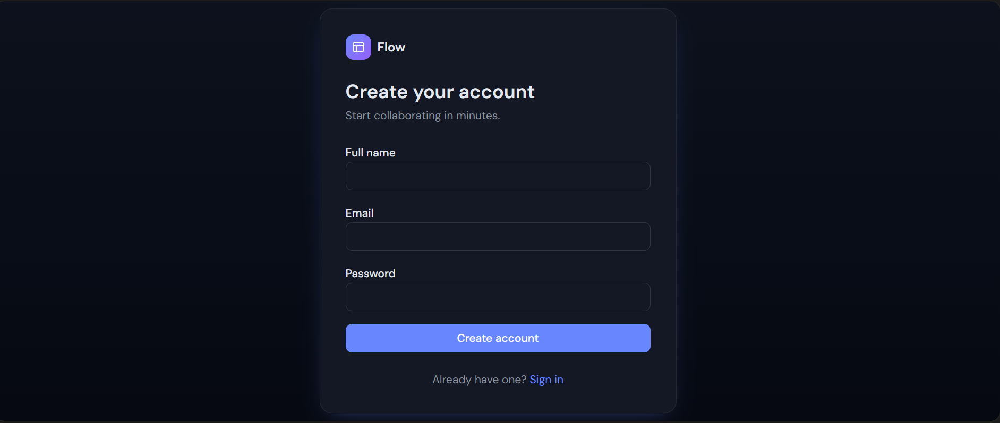
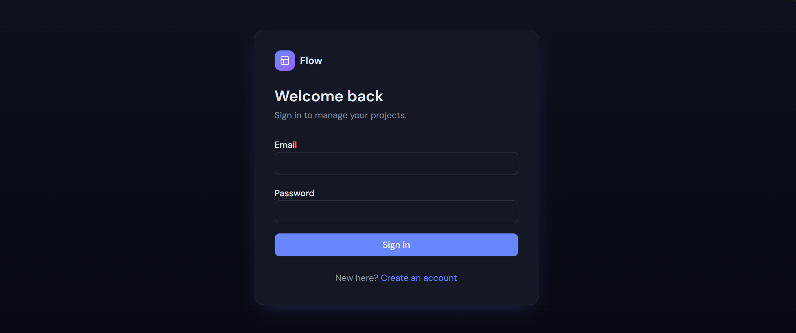
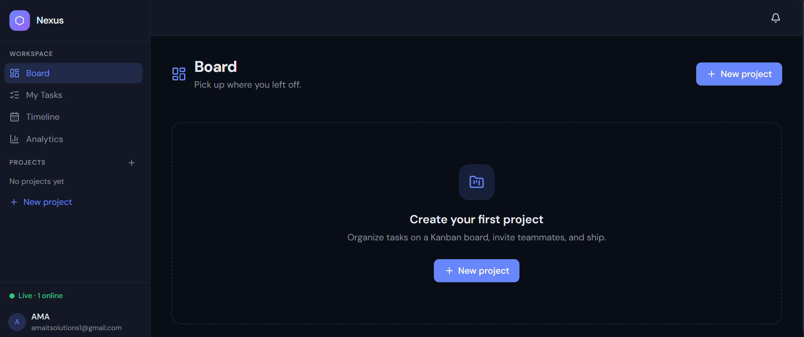
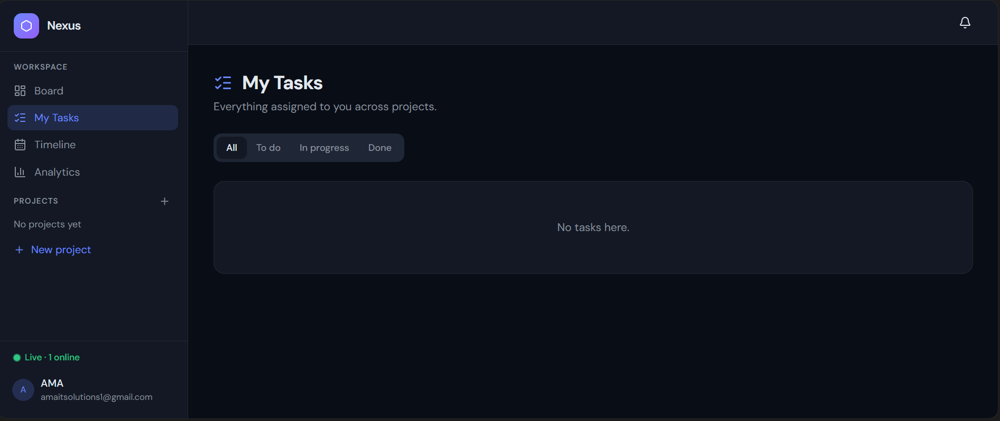
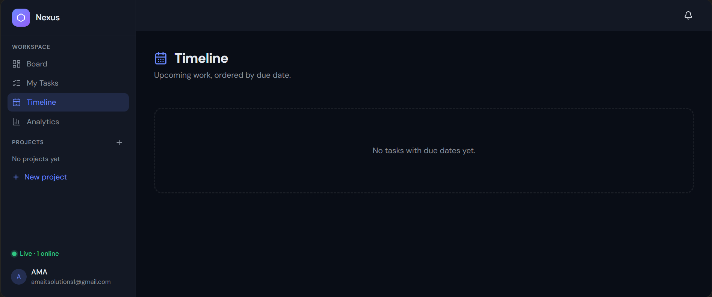
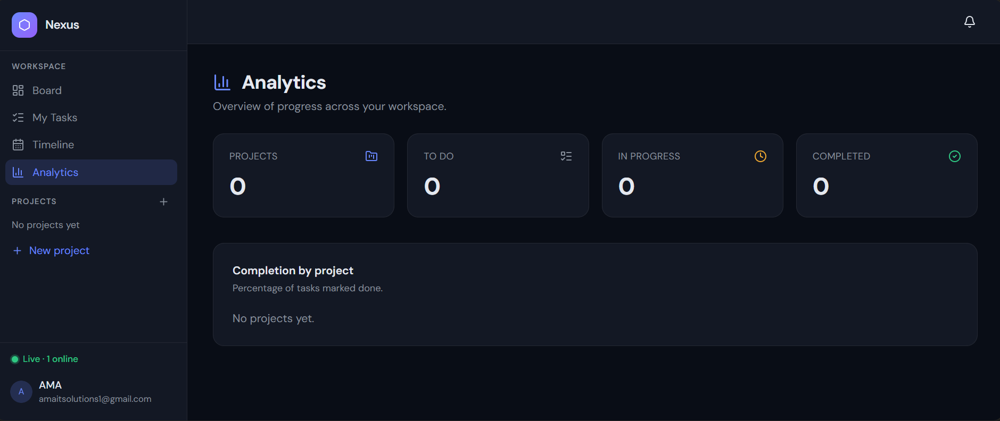

# Flow

Flow is a real-time project management workspace for teams. It includes project dashboards, kanban boards, task assignment, comments, notifications, timeline views, and analytics.

## Screenshots

### Landing Page



### Feature Overview



### Authentication





### Workspace









## Features

- Email/password authentication with Supabase Auth
- Project creation with owner/member access control
- Kanban boards with `To do`, `In progress`, and `Done` columns
- Task details with description, status, assignee, due date, and comments
- Member management by email
- Real-time updates for tasks, comments, project members, and notifications
- Personal task list across projects
- Timeline view for dated work
- Workspace analytics and completion summaries
- Row Level Security policies for project, task, comment, and notification data

## Tech Stack

- React 19
- TypeScript
- Vite
- TanStack Start
- TanStack Router
- Supabase
- Tailwind CSS 4
- Radix UI components
- shadcn-style UI primitives
- Cloudflare Workers deployment via Wrangler

## Project Structure

```txt
src/
  components/              Reusable app and UI components
  hooks/                   Shared React hooks
  integrations/supabase/   Supabase clients, auth helpers, and generated types
  routes/                  TanStack Router file-based routes
  styles.css               Global styles and design tokens
supabase/
  migrations/              Database schema, RLS policies, triggers, and realtime setup
  config.toml              Local Supabase configuration
```

## Prerequisites

- Node.js 20 or newer
- npm or Bun
- A Supabase project
- Supabase CLI, if you want to run or apply migrations locally
- Wrangler, if you want to deploy to Cloudflare

## Environment Variables

Create a `.env` file in the project root with the Supabase values used by the app.

```env
VITE_SUPABASE_URL=your_supabase_project_url
VITE_SUPABASE_PUBLISHABLE_KEY=your_supabase_publishable_key

SUPABASE_URL=your_supabase_project_url
SUPABASE_PUBLISHABLE_KEY=your_supabase_publishable_key
SUPABASE_SERVICE_ROLE_KEY=your_supabase_service_role_key
```

Notes:

- `VITE_SUPABASE_URL` and `VITE_SUPABASE_PUBLISHABLE_KEY` are used in the browser.
- `SUPABASE_URL` and `SUPABASE_PUBLISHABLE_KEY` are used during server-side rendering.
- `SUPABASE_SERVICE_ROLE_KEY` is only for server-side admin operations. Do not expose it to the browser.

## Getting Started

Install dependencies:

```bash
npm install
```

Start the development server:

```bash
npm run dev
```

The app will run on the Vite dev server URL printed in your terminal.

## Database Setup

The Supabase schema lives in `supabase/migrations`.

The migrations create:

- `profiles`
- `projects`
- `project_members`
- `tasks`
- `comments`
- `notifications`
- RLS policies for authenticated access
- triggers for profile creation, project ownership, task updates, and notifications
- realtime publication entries for collaborative updates

Apply the migrations to your Supabase project using your preferred Supabase workflow. For local development with the Supabase CLI, you can use:

```bash
supabase start
supabase db reset
```

For a linked remote project:

```bash
supabase link --project-ref your-project-ref
supabase db push
```

## Available Scripts

```bash
npm run dev        # Start the development server
npm run build      # Build the production app
npm run build:dev  # Build in development mode
npm run preview    # Preview the production build locally
npm run lint       # Run ESLint
npm run format     # Format files with Prettier
```

## Deployment

### Vercel

This app is configured for Vercel with Nitro, which is the supported Vercel deployment path for TanStack Start apps.

In Vercel, use:

- Framework Preset: `TanStack Start` if available, otherwise Vercel can detect Nitro from the build
- Build Command: `npm run build`
- Install Command: `npm install`

Add these environment variables in the Vercel project settings:

```env
VITE_SUPABASE_URL=your_supabase_project_url
VITE_SUPABASE_PUBLISHABLE_KEY=your_supabase_publishable_key
SUPABASE_URL=your_supabase_project_url
SUPABASE_PUBLISHABLE_KEY=your_supabase_publishable_key
SUPABASE_SERVICE_ROLE_KEY=your_supabase_service_role_key
```

Build the app:

```bash
npm run build
```

Then connect the repository to Vercel and deploy.

### Cloudflare

This project still includes `wrangler.jsonc`, but the Vite build is currently configured for Vercel by disabling the Cloudflare build plugin and enabling Nitro.

To deploy to Cloudflare again, switch the Vite config back to the Cloudflare plugin path before building.

## Main Routes

- `/` - landing page
- `/login` - sign in
- `/signup` - create account
- `/dashboard` - project overview
- `/projects/$projectId` - project kanban board
- `/my-tasks` - tasks assigned to the current user
- `/timeline` - upcoming dated tasks
- `/analytics` - workspace progress metrics

## Notes

- The application expects Supabase Auth to be enabled.
- Users are automatically added to `profiles` on signup.
- Project owners are automatically added to `project_members`.
- Project access is controlled through Supabase RLS policies.
- Realtime subscriptions are used throughout the app to refresh collaborative views.
